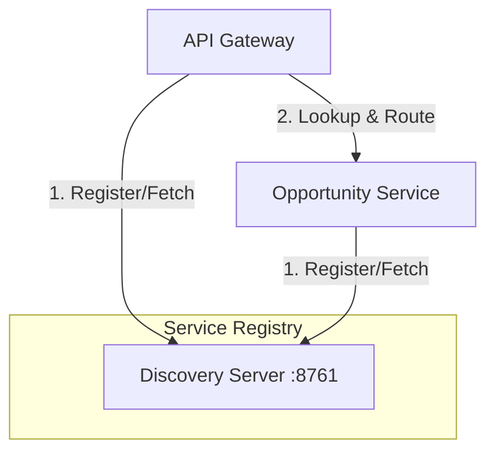

# System Context: Discovery Server

The **TechConnect Discovery Server** (Eureka) is the brain of the microservices ecosystem. It tracks where every service is located, allowing them to find each other without hardcoded IP addresses.

## Architectural Role

In a dynamic environment, service instances can scale up, down, or change addresses. The Discovery Server maintains a registry of all "up" instances.

## How it works

1. **Registration**: When a service (like the Opportunity Service) starts, it sends its coordinates (IP/Port) to the Discovery Server.
2. **Heartbeats**: Services send periodic "heartbeats" to stay "UP" in the registry.
3. **Discovery**: When the API Gateway needs to talk to the Opportunity Service, it asks the Discovery Server for the address of `opportunity-service`.
4. **Client-Side Load Balancing**: The Gateway receives the list of addresses and chooses one (usually via Spring Cloud LoadBalancer).

## Integration Points

- **API Gateway**: Uses the registry to route requests to backend services.
- **Microservices**: Every backend service must be configured as a Eureka Client to participate in the ecosystem.
